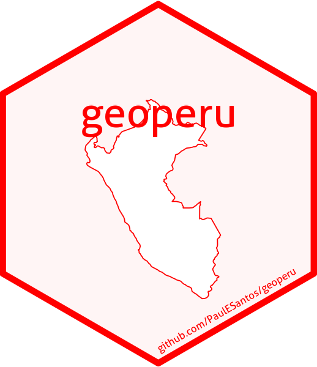
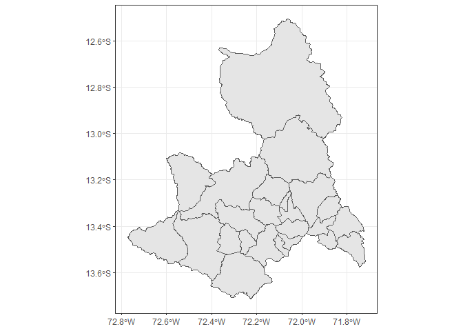
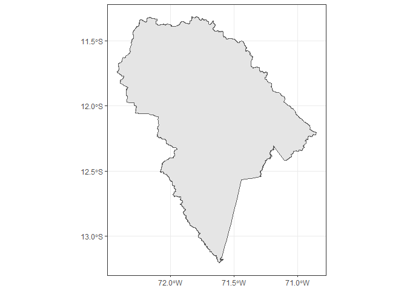

<!-- README.md is generated from README.Rmd. Please edit that file -->

# geoperu

## <a href='https://github.com/PaulESantos/geoperu'></a>

<!-- badges: start -->

[](https://CRAN.R-project.org/package=geoperu)
[](https://cran.r-project.org/package=geoperu)
[](https://cran.r-project.org/package=geoperu)
[](https://app.codecov.io/gh/PaulESantos/geoperu?branch=main)
[](https://github.com/PaulESantos/geoperu/actions/workflows/R-CMD-check.yaml)
[](https://doi.org/10.32614/CRAN.package.geoperu)

[](https://lifecycle.r-lib.org/articles/stages.html#stable)
<!-- badges: end -->

The `geoperu` package provides a convenient interface to access official
spatial datasets of Peru directly from R. These data are collected from
the National Institute of Statistics and Informatics (INEI) of Peru.

## Installation

You can install the development version of `geoperu` as follows:

``` r
pak::pak("PaulESantos/geoperu")
```

To access spatial information of districts from any province in Peru,
you can use the `get_geo_peru()` function.

``` r

library(geoperu)
#> This is geoperu 0.0.0.2

cusco <- geoperu::get_geo_peru(geography = "CUSCO", 
                                  level = "dep",
                                  simplified = FALSE)
cusco
#> Simple feature collection with 112 features and 4 fields
#> Geometry type: MULTIPOLYGON
#> Dimension:     XY
#> Bounding box:  xmin: -73.9811 ymin: -15.45829 xmax: -70.34507 ymax: -11.21229
#> Geodetic CRS:  WGS 84
#> First 10 features:
#>    departamento    provincia       distrito        capital
#> 1         CUSCO      ESPINAR       PICHIGUA       PICHIGUA
#> 2         CUSCO      ESPINAR    SUYCKUTAMBO SUYCKUTAMBO /5
#> 3         CUSCO      ESPINAR       PALLPATA  HECTOR TEJADA
#> 4         CUSCO      ESPINAR        ESPINAR          YAURI
#> 5         CUSCO QUISPICANCHI ANDAHUAYLILLAS ANDAHUAYLILLAS
#> 6         CUSCO        CALCA          LARES          LARES
#> 7         CUSCO CHUMBIVILCAS         LLUSCO         LLUSCO
#> 8         CUSCO      ESPINAR        OCORURO        OCORURO
#> 9         CUSCO        CALCA          CALCA          CALCA
#> 10        CUSCO      ACOMAYO   MOSOC LLACTA   MOSOC LLACTA
#>                              geom
#> 1  MULTIPOLYGON (((-71.18148 -...
#> 2  MULTIPOLYGON (((-71.51302 -...
#> 3  MULTIPOLYGON (((-70.97839 -...
#> 4  MULTIPOLYGON (((-71.36934 -...
#> 5  MULTIPOLYGON (((-71.6563 -1...
#> 6  MULTIPOLYGON (((-71.90762 -...
#> 7  MULTIPOLYGON (((-72.10355 -...
#> 8  MULTIPOLYGON (((-71.05453 -...
#> 9  MULTIPOLYGON (((-71.87228 -...
#> 10 MULTIPOLYGON (((-71.43954 -...
cusco_simplified <- geoperu::get_geo_peru(geography = "CUSCO", 
                                  level = "dep",
                                  simplified = TRUE)
cusco_simplified
#> Simple feature collection with 1 feature and 1 field
#> Geometry type: POLYGON
#> Dimension:     XY
#> Bounding box:  xmin: -73.9811 ymin: -15.45829 xmax: -70.34507 ymax: -11.21229
#> Geodetic CRS:  WGS 84
#>   departamento                           geom
#> 1        CUSCO POLYGON ((-70.8315 -14.0698...

prov_sf <- geoperu::get_geo_peru(geography = "ANTA",
                                 level = "prov", 
                                 simplified = TRUE)
prov_sf
#> Simple feature collection with 1 feature and 1 field
#> Geometry type: POLYGON
#> Dimension:     XY
#> Bounding box:  xmin: -72.77286 ymin: -13.71406 xmax: -72.00001 ymax: -13.28477
#> Geodetic CRS:  WGS 84
#>   provincia                           geom
#> 1      ANTA POLYGON ((-72.11767 -13.396...
islay_sf <- geoperu::get_geo_peru(geography = "ISLAY",
                                 level = "prov", 
                                 simplified = FALSE)
islay_sf
#> Simple feature collection with 6 features and 5 fields
#> Geometry type: MULTIPOLYGON
#> Dimension:     XY
#> Bounding box:  xmin: -72.22384 ymin: -17.28501 xmax: -71.30225 ymax: -16.67504
#> Geodetic CRS:  WGS 84
#>              tag departamento provincia        distrito          capital
#> 1 arequipa_islay     AREQUIPA     ISLAY PUNTA DE BOMBON  PUNTA DE BOMBON
#> 2 arequipa_islay     AREQUIPA     ISLAY           MEJIA            MEJIA
#> 3 arequipa_islay     AREQUIPA     ISLAY           ISLAY ISLAY (MATARANI)
#> 4 arequipa_islay     AREQUIPA     ISLAY      COCACHACRA       COCACHACRA
#> 5 arequipa_islay     AREQUIPA     ISLAY   DEAN VALDIVIA         LA CURVA
#> 6 arequipa_islay     AREQUIPA     ISLAY        MOLLENDO         MOLLENDO
#>                             geom
#> 1 MULTIPOLYGON (((-71.44018 -...
#> 2 MULTIPOLYGON (((-71.8306 -1...
#> 3 MULTIPOLYGON (((-71.99808 -...
#> 4 MULTIPOLYGON (((-71.48244 -...
#> 5 MULTIPOLYGON (((-71.76488 -...
#> 6 MULTIPOLYGON (((-71.66772 -...
```

To visualize the retrieved geospatial information with the
`get_geo_peru()` function from the geoperu package, you can use various
tools in R. A common option is to use the `ggplot2` library along with
`sf` object visualization functionality.

Here’s a basic example of how to visualize the data:

``` r
library(patchwork)
library(ggplot2)
plot1 <- cusco |> 
  ggplot() +
  geom_sf() +
  theme_bw()

plot2 <- cusco_simplified |> 
  ggplot() +
  geom_sf() +
  theme_bw()

plot1 + plot2
```



`geoperu` also provides access to spatial information of natural
protected areas in Peru. These areas, managed and declared by the
National Service of Natural Protected Areas (SERNAP), encompass a
diverse range of ecosystems. The `get_anp_peru()` function allows users
to download spatial data representing these protected areas directly
into their R environment.

``` r
manu <- get_anp_peru(anp = "manu")
manu
#> Simple feature collection with 1 feature and 4 fields
#> Geometry type: POLYGON
#> Dimension:     XY
#> Bounding box:  xmin: -72.41719 ymin: -13.2059 xmax: -70.85217 ymax: -11.31585
#> Geodetic CRS:  WGS 84
#>          anp_cate anp_nombre anp_sect              anp_ubpo
#> 1 Parque Nacional       Manu     <NA> Cusco y Madre de Dios
#>                             geom
#> 1 POLYGON ((-71.36212 -11.656...

manu |> 
  ggplot() +
  geom_sf() +
  theme_bw()
```



- You can customize the plot by adding additional layers, adjusting
  styles, and adding labels according to your specific needs.
