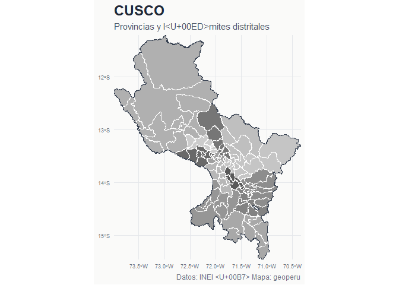
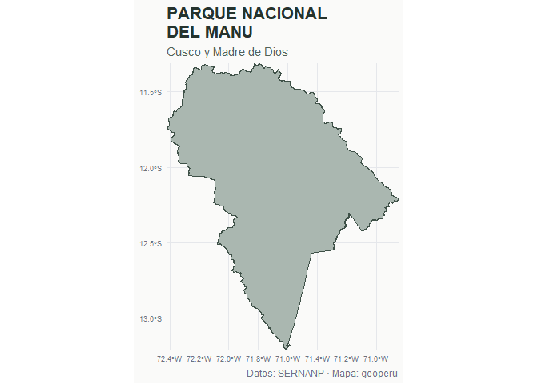

<!-- README.md is generated from README.Rmd. Please edit that file -->

# geoperu

<!-- badges: start -->

[](https://CRAN.R-project.org/package=geoperu)
[](https://cran.r-project.org/package=geoperu)
[](https://cran.r-project.org/package=geoperu)
[](https://app.codecov.io/gh/PaulESantos/geoperu?branch=main)
[](https://github.com/PaulESantos/geoperu/actions/workflows/R-CMD-check.yaml)
[](https://doi.org/10.32614/CRAN.package.geoperu)

[](https://lifecycle.r-lib.org/articles/stages.html#stable)
<!-- badges: end -->

`geoperu` provides official spatial datasets of Peru as `sf` objects. It
includes administrative boundaries published by the National Institute
of Statistics and Informatics (INEI), plus protected natural areas from
SERNANP. The returned objects work directly with `ggplot2`, `dplyr`, and
the wider spatial R ecosystem.

## Installation

Install the released version of `geoperu` from CRAN:

``` r
install.packages("geoperu")
```

Install the development version from GitHub with `pak`:

``` r
pak::pak("PaulESantos/geoperu")
```

## Administrative boundaries

Use `get_geo_peru()` to download administrative boundaries. `geography`
accepts one or more names, case-insensitively. Use `"all"` to retrieve
every unit at the chosen level.

| `level` | `simplified = TRUE` | `simplified = FALSE` |
|----|----|----|
| `"all"` | One national polygon | District-level data for all Peru |
| `"dep"` | One polygon for each of 25 departments | District-level data for the selected departments |
| `"prov"` | One polygon for each of 196 provinces | District-level data for the selected provinces |

For example, retrieve a single department, all departments, or one
province:

``` r

library(geoperu)
#> This is geoperu 0.0.2

cusco <- geoperu::get_geo_peru(geography = "CUSCO", 
                               level = "dep",
                               simplified = FALSE,
                               showProgress = FALSE)
cusco
#> Simple feature collection with 112 features and 4 fields
#> Geometry type: MULTIPOLYGON
#> Dimension:     XY
#> Bounding box:  xmin: -73.9811 ymin: -15.45829 xmax: -70.34507 ymax: -11.21229
#> Geodetic CRS:  WGS 84
#> First 10 features:
#>    departamento    provincia       distrito        capital
#> 1         CUSCO      ESPINAR       PICHIGUA       PICHIGUA
#> 2         CUSCO      ESPINAR    SUYCKUTAMBO SUYCKUTAMBO /5
#> 3         CUSCO      ESPINAR       PALLPATA  HECTOR TEJADA
#> 4         CUSCO      ESPINAR        ESPINAR          YAURI
#> 5         CUSCO QUISPICANCHI ANDAHUAYLILLAS ANDAHUAYLILLAS
#> 6         CUSCO        CALCA          LARES          LARES
#> 7         CUSCO CHUMBIVILCAS         LLUSCO         LLUSCO
#> 8         CUSCO      ESPINAR        OCORURO        OCORURO
#> 9         CUSCO        CALCA          CALCA          CALCA
#> 10        CUSCO      ACOMAYO   MOSOC LLACTA   MOSOC LLACTA
#>                              geom
#> 1  MULTIPOLYGON (((-71.18148 -...
#> 2  MULTIPOLYGON (((-71.51302 -...
#> 3  MULTIPOLYGON (((-70.97839 -...
#> 4  MULTIPOLYGON (((-71.36934 -...
#> 5  MULTIPOLYGON (((-71.6563 -1...
#> 6  MULTIPOLYGON (((-71.90762 -...
#> 7  MULTIPOLYGON (((-72.10355 -...
#> 8  MULTIPOLYGON (((-71.05453 -...
#> 9  MULTIPOLYGON (((-71.87228 -...
#> 10 MULTIPOLYGON (((-71.43954 -...
cusco_simplified <- geoperu::get_geo_peru(geography = "CUSCO", 
                                          level = "dep",
                                          simplified = TRUE,
                                          showProgress = FALSE)
cusco_simplified
#> Simple feature collection with 1 feature and 1 field
#> Geometry type: POLYGON
#> Dimension:     XY
#> Bounding box:  xmin: -73.9811 ymin: -15.45829 xmax: -70.34507 ymax: -11.21229
#> Geodetic CRS:  WGS 84
#>   departamento                           geom
#> 1        CUSCO POLYGON ((-70.8315 -14.0698...

departamentos <- geoperu::get_geo_peru(
  geography = "all",
  level = "dep",
  simplified = TRUE,
  showProgress = FALSE
)
departamentos
#> Simple feature collection with 25 features and 1 field
#> Geometry type: GEOMETRY
#> Dimension:     XY
#> Bounding box:  xmin: -81.3282 ymin: -18.35093 xmax: -68.65228 ymax: -0.03860597
#> Geodetic CRS:  WGS 84
#> First 10 features:
#>    departamento                           geom
#> 1      AMAZONAS POLYGON ((-78.13669 -6.5584...
#> 2        ANCASH POLYGON ((-77.69875 -10.322...
#> 3      APURIMAC POLYGON ((-72.75032 -13.478...
#> 4      AREQUIPA POLYGON ((-71.9485 -17.0676...
#> 5      AYACUCHO POLYGON ((-73.61616 -14.068...
#> 6     CAJAMARCA POLYGON ((-79.17066 -4.965,...
#> 7        CALLAO POLYGON ((-77.08812 -12.060...
#> 8         CUSCO POLYGON ((-70.8315 -14.0698...
#> 9  HUANCAVELICA POLYGON ((-75.51096 -13.588...
#> 10      HUANUCO POLYGON ((-76.911 -9.368459...

prov_sf <- geoperu::get_geo_peru(geography = "ANTA",
                                 level = "prov", 
                                 simplified = TRUE,
                                 showProgress = FALSE)
prov_sf
#> Simple feature collection with 1 feature and 1 field
#> Geometry type: POLYGON
#> Dimension:     XY
#> Bounding box:  xmin: -72.77286 ymin: -13.71406 xmax: -72.00001 ymax: -13.28477
#> Geodetic CRS:  WGS 84
#>   provincia                           geom
#> 1      ANTA POLYGON ((-72.11767 -13.396...
islay_sf <- geoperu::get_geo_peru(geography = "ISLAY",
                                  level = "prov",
                                  simplified = FALSE,
                                  showProgress = FALSE)
islay_sf
#> Simple feature collection with 6 features and 5 fields
#> Geometry type: MULTIPOLYGON
#> Dimension:     XY
#> Bounding box:  xmin: -72.22384 ymin: -17.28501 xmax: -71.30225 ymax: -16.67504
#> Geodetic CRS:  WGS 84
#>              tag departamento provincia        distrito          capital
#> 1 arequipa_islay     AREQUIPA     ISLAY PUNTA DE BOMBON  PUNTA DE BOMBON
#> 2 arequipa_islay     AREQUIPA     ISLAY           MEJIA            MEJIA
#> 3 arequipa_islay     AREQUIPA     ISLAY           ISLAY ISLAY (MATARANI)
#> 4 arequipa_islay     AREQUIPA     ISLAY      COCACHACRA       COCACHACRA
#> 5 arequipa_islay     AREQUIPA     ISLAY   DEAN VALDIVIA         LA CURVA
#> 6 arequipa_islay     AREQUIPA     ISLAY        MOLLENDO         MOLLENDO
#>                             geom
#> 1 MULTIPOLYGON (((-71.44018 -...
#> 2 MULTIPOLYGON (((-71.8306 -1...
#> 3 MULTIPOLYGON (((-71.99808 -...
#> 4 MULTIPOLYGON (((-71.48244 -...
#> 5 MULTIPOLYGON (((-71.76488 -...
#> 6 MULTIPOLYGON (((-71.66772 -...
```

When a request needs multiple files, `geoperu` downloads the missing
files concurrently and reuses files cached during the R session. For a
national map, prefer `simplified = TRUE`; it transfers and plots far
less geometry.

The objects returned by `geoperu` work directly with `ggplot2`. A
restrained grey scale, fine district borders, and a geographic grid
produce a clear, technical map of Cusco:

``` r
library(ggplot2)

ggplot() +
  geom_sf(
    data = cusco,
    aes(fill = provincia),
    color = "#FFFFFF",
    linewidth = 0.15
  ) +
  geom_sf(
    data = cusco_simplified,
    fill = NA,
    color = "#374151",
    linewidth = 0.7
  ) +
  scale_fill_grey(start = 0.35, end = 0.8, guide = "none") +
  coord_sf(expand = FALSE) +
  labs(
    title = "CUSCO",
    subtitle = "Provincias y límites distritales",
    caption = "Datos: INEI · Mapa: geoperu"
  ) +
  theme_minimal(base_size = 11) +
  theme(
    plot.background = element_rect(fill = "#FAFAF9", color = NA),
    panel.background = element_rect(fill = "#FAFAF9", color = NA),
    panel.grid = element_line(color = "#E5E7EB", linewidth = 0.3),
    axis.text = element_text(color = "#6B7280", size = 7),
    plot.title = element_text(color = "#1F2937", size = 18, face = "bold"),
    plot.subtitle = element_text(color = "#4B5563"),
    plot.caption = element_text(color = "#6B7280")
  )
```



## Protected natural areas

`get_anp_peru()` downloads protected natural areas declared by the
National Service of Natural Areas Protected by the State (SERNANP).

``` r
manu <- get_anp_peru(anp = "manu", showProgress = FALSE)
manu
#> Simple feature collection with 1 feature and 4 fields
#> Geometry type: POLYGON
#> Dimension:     XY
#> Bounding box:  xmin: -72.41719 ymin: -13.2059 xmax: -70.85217 ymax: -11.31585
#> Geodetic CRS:  WGS 84
#>          anp_cate anp_nombre anp_sect              anp_ubpo
#> 1 Parque Nacional       Manu     <NA> Cusco y Madre de Dios
#>                             geom
#> 1 POLYGON ((-71.36212 -11.656...

manu |> 
  ggplot() +
  geom_sf(fill = "#AAB7B0", color = "#3F5148", linewidth = 0.7) +
  coord_sf(expand = FALSE) +
  labs(
    title = "PARQUE NACIONAL\nDEL MANU",
    subtitle = "Cusco y Madre de Dios",
    caption = "Datos: SERNANP · Mapa: geoperu"
  ) +
  theme_minimal(base_size = 11) +
  theme(
    plot.background = element_rect(fill = "#FAFAF9", color = NA),
    panel.background = element_rect(fill = "#FAFAF9", color = NA),
    panel.grid = element_line(color = "#E5E7EB", linewidth = 0.3),
    axis.text = element_text(color = "#6B7280", size = 7),
    plot.title = element_text(
      color = "#26332D", size = 16, face = "bold", hjust = 0,
      lineheight = 0.9
    ),
    plot.subtitle = element_text(color = "#526159"),
    plot.caption = element_text(color = "#6B7280")
  )
```



These maps use only `ggplot2`; colors, typography, and line widths can
be adapted without modifying the spatial data.
