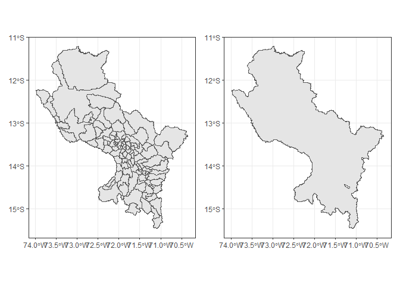

<!-- README.md is generated from README.Rmd. Please edit that file -->

# geoperu

<!-- badges: start -->

[](https://lifecycle.r-lib.org/articles/stages.html#experimental)
[](https://CRAN.R-project.org/package=geoperu)
<!-- badges: end -->

The `geoperu` package provides a convenient interface to access official
spatial datasets of Peru directly from R. These data are collected from
the National Institute of Statistics and Informatics (INEI) of Peru.

## Installation

You can install the development version of `geoperu` as follows:

``` r
pak::pak("PaulESantos/geoperu")
```

To access spatial information of districts from any province in Peru,
you can use the `get_geo_peru()` function.

``` r

library(geoperu)
#> This is geoperu 0.0.0.1

cusco <- geoperu::get_geo_peru(geography = "CUSCO", 
                                  level = "dep",
                                  simplified = FALSE)
cusco
#> Simple feature collection with 112 features and 4 fields
#> Geometry type: MULTIPOLYGON
#> Dimension:     XY
#> Bounding box:  xmin: -73.9811 ymin: -15.45829 xmax: -70.34507 ymax: -11.21229
#> Geodetic CRS:  WGS 84
#> First 10 features:
#>    departamento    provincia       distrito        capital
#> 1         CUSCO      ESPINAR       PICHIGUA       PICHIGUA
#> 2         CUSCO      ESPINAR    SUYCKUTAMBO SUYCKUTAMBO /5
#> 3         CUSCO      ESPINAR       PALLPATA  HECTOR TEJADA
#> 4         CUSCO      ESPINAR        ESPINAR          YAURI
#> 5         CUSCO QUISPICANCHI ANDAHUAYLILLAS ANDAHUAYLILLAS
#> 6         CUSCO        CALCA          LARES          LARES
#> 7         CUSCO CHUMBIVILCAS         LLUSCO         LLUSCO
#> 8         CUSCO      ESPINAR        OCORURO        OCORURO
#> 9         CUSCO        CALCA          CALCA          CALCA
#> 10        CUSCO      ACOMAYO   MOSOC LLACTA   MOSOC LLACTA
#>                              geom
#> 1  MULTIPOLYGON (((-71.18148 -...
#> 2  MULTIPOLYGON (((-71.51302 -...
#> 3  MULTIPOLYGON (((-70.97839 -...
#> 4  MULTIPOLYGON (((-71.36934 -...
#> 5  MULTIPOLYGON (((-71.6563 -1...
#> 6  MULTIPOLYGON (((-71.90762 -...
#> 7  MULTIPOLYGON (((-72.10355 -...
#> 8  MULTIPOLYGON (((-71.05453 -...
#> 9  MULTIPOLYGON (((-71.87228 -...
#> 10 MULTIPOLYGON (((-71.43954 -...
cusco_simplified <- geoperu::get_geo_peru(geography = "CUSCO", 
                                  level = "dep",
                                  simplified = TRUE)
cusco_simplified
#> Simple feature collection with 1 feature and 1 field
#> Geometry type: POLYGON
#> Dimension:     XY
#> Bounding box:  xmin: -73.9811 ymin: -15.45829 xmax: -70.34507 ymax: -11.21229
#> Geodetic CRS:  WGS 84
#>   departamento                           geom
#> 1        CUSCO POLYGON ((-70.8315 -14.0698...

prov_sf <- geoperu::get_geo_peru(geography = "ANTA",
                                 level = "prov", 
                                 simplified = TRUE)
prov_sf
#> Simple feature collection with 1 feature and 1 field
#> Geometry type: POLYGON
#> Dimension:     XY
#> Bounding box:  xmin: -72.77286 ymin: -13.71406 xmax: -72.00001 ymax: -13.28477
#> Geodetic CRS:  WGS 84
#>   provincia                           geom
#> 1      ANTA POLYGON ((-72.11767 -13.396...
```

To visualize the retrieved geospatial information with the
`get_geo_peru()` function from the geoperu package, you can use various
tools in R. A common option is to use the `ggplot2` library along with
`sf` object visualization functionality.

Here’s a basic example of how to visualize the data:

``` r
library(patchwork)
library(ggplot2)
plot1 <- cusco |> 
  ggplot() +
  geom_sf() +
  theme_bw()

plot2 <- cusco_simplified |> 
  ggplot() +
  geom_sf() +
  theme_bw()

plot1 + plot2
```

 You
can customize the plot by adding additional layers, adjusting styles,
and adding labels according to your specific needs.
